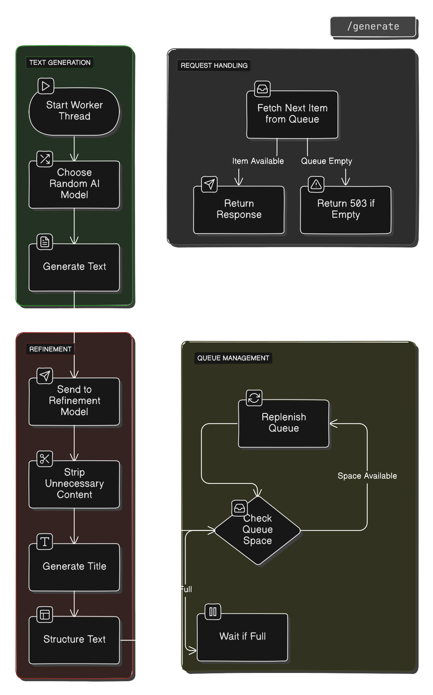

# NoteWaver

## Overview

**NoteWaver** is a simple microservice that generates short literary-style text
using AI models from Hugging Face. It uses FastAPI to serve the generated texts
through an API and runs a background worker to keep a queue of ready-to-use
results.

## Features

- **Text Generation**: Creates 350-character literary passages using different
  AI models.
- **Queue System**: Keeps up to 15 generated texts ready for quick access.
- **Text Cleanup**: Automatically cleans up and formats the generated text,
  adding a title.

## API

### `GET /generate`

- **Description**: Returns a pre-generated literary text.
- **Responses**:
    - **200 OK**: Returns a JSON object with a title and text.
    - **503 Service Unavailable**: Queue is empty; try again later.

## How it Works

- **Background Worker**: Fills the queue by generating and formatting texts in
  the background.
- **Queue**: Holds up to 15 generated texts, ensuring the service is always
  ready to respond quickly.